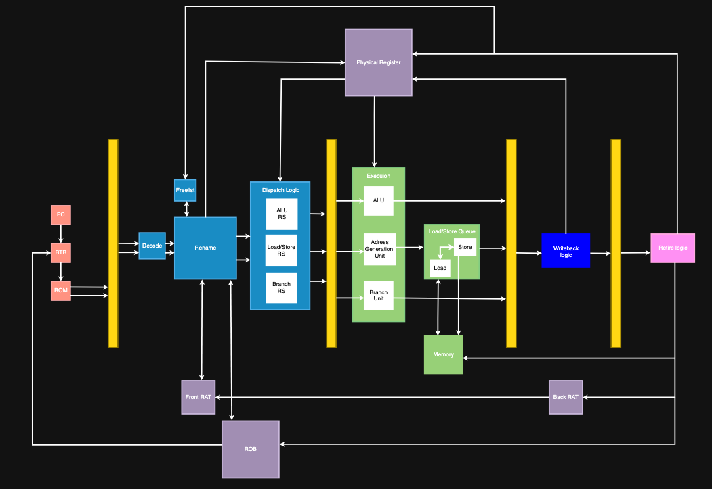

# 2-way Superscalar RISC-V CPU

## Introduction
I previously implemented a 5-stage pipelined CPU, which provided valuable practice for consolidating fundamental computer architecture knowledge. Most advanced computer architecture courses focus primarily on teaching concepts and running simple simulations of out-of-order CPU features. Therefore, implementing a superscalar, out-of-order CPU from scratch offers excellent hands-on experience. It is also a significant challenge, as this type of CPU presents greater complexity in data interleaving and component communication, revealing many design problems not typically covered in coursework.

## Design Overview

This project implements an out-of-order, 32-bit processor based on the RISC-V instruction set with 2-way issue per cycle. To simplify the initial design, this version uses separate memory for instruction ROM and data RAM; cache design will be added in future versions.

## Features

### A. Fetch Stage
The CPU fetches two instructions per cycle based on the program counter (PC). It supports branch prediction using a Branch Target Buffer (BTB) to handle three scenarios:
1. **First instruction is a branch/jump**: The second instruction is fetched from the predicted target address.
2. **Second instruction is a branch/jump**: The PC is updated with the predicted target address.
3. **Both instructions are branches/jumps**: The second instruction is fetched based on the first prediction, and the PC is updated using the second prediction.

### B. Decode, Rename, and Dispatch
Instructions are decoded according to the RISC-V instruction set, then proceed through the renaming stage, which:
- Checks whether registers need to be renamed to resolve data dependencies
- **FreeList Allocation**: Allocates free physical registers from the FreeList for destination registers
- **ROB Allocation**: Sends necessary instruction information to the Reorder Buffer in program order
- **Front RAT Update**: Maps architectural registers to newly allocated physical registers, enabling speculative register renaming for out-of-order execution

After renaming, decoded instructions and their ROB IDs are stored in the Reservation Station. The Reservation Station is divided into three types based on instruction categories—Arithmetic, Load/Store, and Branch—allowing each type to be executed by its dedicated execution unit, improving throughput.

### C. Issue and Execution
Instructions are issued from the Reservation Station when their operands are ready. The CPU executes instructions in a single cycle using three specialized units:
- **ALU (Arithmetic Logic Unit)**: Selects data sources and computes results based on the opcode
- **LSU (Load/Store Unit)**: Functions as an Address Generation Unit, computing memory addresses and generating data that is stored in the Load/Store Queue
- **BRU (Branch Resolution Unit)**: Evaluates branch conditions, verifies prediction accuracy, and generates the correct branch target

### D. WriteBack
During the WriteBack stage, instruction results are committed to the processor state:
- **Physical Register Update**: Results are written back to the physical registers allocated during the rename stage
- **Reorder Buffer (ROB) Update**: The ROB is notified of instruction completion, marking the entry as ready for retirement
- **Memory Forwarding**: For load/store instructions, results are forwarded to dependent instructions with matching addresses in the execution pipeline to prevent data hazards

This stage ensures that all instruction results are properly committed and available for subsequent instructions, maintaining data consistency across the processor.

### E. Retire
Although instructions may execute out-of-order, they must retire in program order to maintain precise architectural state. The retirement process works as follows:

- **ROB Head Monitoring**: The CPU continuously checks the head of the Reorder Buffer to determine if the oldest instruction has completed execution
- **In-Order Retirement**: When the head entry is marked as complete, the instruction is safely retired, and its results are committed to the architectural register file
- **Back RAT Update**: The Back RAT (Register Alias Table) is updated to reflect the committed architectural-to-physical register mappings, establishing a recovery checkpoint for exception handling and branch misprediction
- **Resource Reclamation**: Upon retirement, the physical register previously mapped to the destination architectural register is returned to the FreeList for reuse
- **Exception Handling**: If an instruction at the ROB head raises an exception, the CPU can precisely identify the faulting instruction and flush all subsequent speculative instructions, restoring the processor state from the Back RAT

This stage ensures correct program semantics while maintaining the performance benefits of out-of-order execution.

